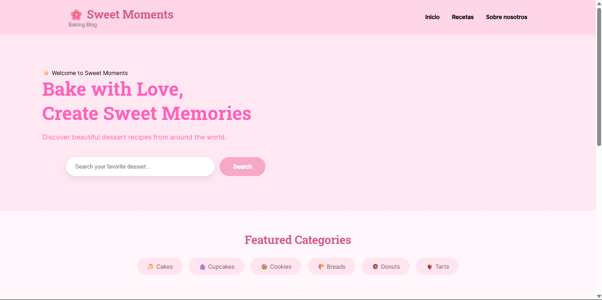
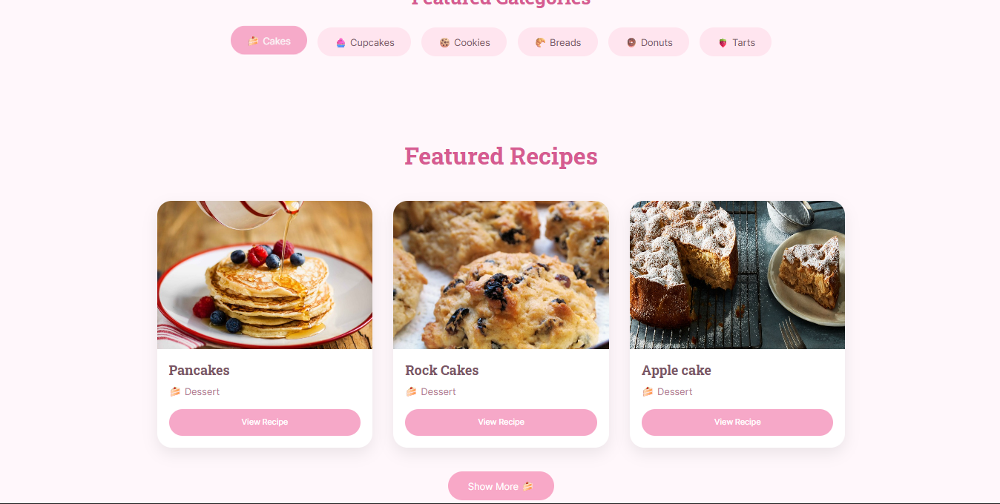

# 🍰 Sweet Moments

Sweet Moments is a React web application where users can search for delicious dessert recipes using TheMealDB API. The project features a soft pastel design inspired by a bakery blog, making recipe browsing enjoyable and visually appealing.

## ✨ Features

- 🔍 Search for dessert recipes
- 🍓 Browse recipes by category
- 📖 View detailed recipe information in a modal
- 🥣 Ingredients and cooking instructions
- ⏳ Loading spinner while fetching recipes
- ❌ Friendly "No recipes found" message
- ➕ "Show More" button to display additional recipes
- 📱 Responsive design for desktop and mobile
- 🎨 Custom pastel pink UI

## 🛠️ Built With

- React
- React Router DOM
- Vite
- JavaScript (ES6)
- CSS3
- TheMealDB API

## 📂 Project Structure

```
src/
│
├── components/
├── images/
├── utils/
├── vendor/
├── index.css
└── main.jsx
```

## 🚀 Installation

Clone the repository:

```bash
git clone git@github.com:alejandraco0109/mybakingpage.git
```

Navigate to the project folder:

```bash
cd YOUR-REPOSITORY
```

Install dependencies:

```bash
npm install
```

Start the development server:

```bash
npm run dev
```

Open:

```
http://localhost:5173
```

## 🌐 API

This project uses the free **TheMealDB API**.

https://www.themealdb.com/api.php

Example request:

```
https://www.themealdb.com/api/json/v1/1/search.php?s=cake
```

## 📸 Screenshots






## 👩‍💻 Author

Developed by **Alejandra Toro Arcila** ❤️

---

Made with lots of ☕, 🍓 and 🍰.
